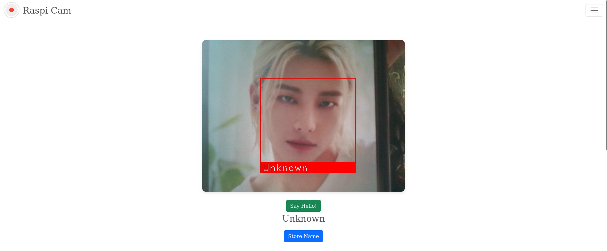
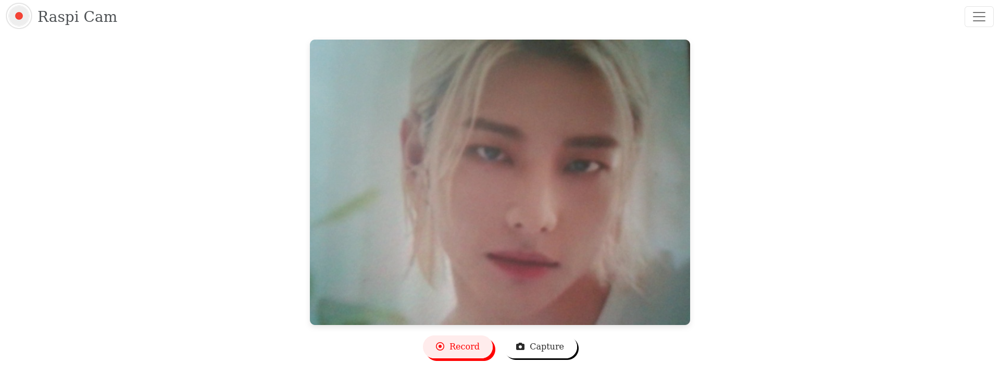

# Raspi-Camera-Doorbell

Raspi-Cam is a door camera with face detection and recognition capabilities. It also has the ability to stream, record and capture still images from the live feed of the camera. A user may check the live feed of their door front remotely from their work or other places. A user may also remotely send a "Hello" to the person at the door.

<!-- PROJECT LOGO -->
<br />
<div align="center">
    
    <h3 align="center">Raspi-Cam</h3>
</div>

## Setup using Python on Raspberry Pi 3b or higher

1. Clone the repo
   ```sh
   git clone https://github.com/priyanka-maz/raspi-camera-doorbell
   ```

2. After cloning or downloading the codebase src/ dir to /path/to/src
    ```sh
    cd /path/to/src
    python3 -m pip install -r requirements.txt
    python3 app.py
    ```
3. The original use is meant to be on a Raspberry Pi, 3b or higher versions. 
   Depending on the camera used, please change the index of VideoCapture in app.py:
   ```python
   camera = cv2.VideoCapture(0, cv2.CAP_V4L2)
   ```
## Screenshots







## Features

- Users can remotely access cctv footage from Raspi-cam
- Unknown people are detected and they can be marked as known
- Face detection and recognition is used to detect 
  known people and display their names
- Users may click on the "Say Hello" button on the homepage 
  to send a voice generated greeting to the person at the door
- Users may capture images or record any activity at the door
  which could turn useful as evidence should any illegal activity take place
- Users may check their contact list to see all people recognizable by the camera

## File Structure

```
.
├── app.py.......................Python script that runs the entire system
├── data.json....................Names and face encodings of known people stored 
├── haarcascades.................xml files for face detection
├── LICENSE......................MIT LICENSE
├── README.md....................Documentation
├── requirements.txt
├── static
│   ├── captures.................Saves images captured by user
│   ├── contacts.................Saves images of known people
│   │   ├── Keanu Reaves.png
│   │   └── Ryan Reynolds.png
│   ├── favicon.ico
│   ├── output.mp3...............Text-to-Speech file of Greeting
│   ├── style.css................CSS styling
│   └── video....................Recordings made by user saved in mp4 format
└── templates....................HTML templates some of which use jinja
    ├── aboutus.html
    ├── captures.html
    ├── cctv.html
    ├── contact.html
    ├── header.html
    ├── index.html
    └── recordings.html
```
